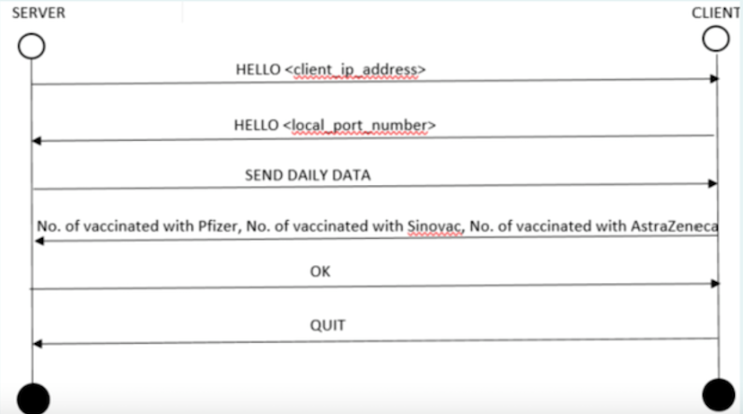

# Covid

Центрите за вакцинација низ државата секојдневно испраќаат информации до централниот сервер за аналитика на податоците.
Се испраќаат информации за бројот вакцинирани со Фајзер, бројот на вакцинирани со Синовакс и бројот на вакцинирани со
АстраЗенека на дневно ниво. На сликата е прикажано сценарио за комуникација меѓу серверот и клиентот при праќање на
дневната статистика. Ваша задача е да го имплементирате целиот проблем со тоа што:

- серверот треба да слуша на порта 5555.
- серверот треба да поддржува конкурентна комуникација со повеќе клиенти (ковид центри).

Сите податоци кои серверот ги добива од клиентот треба да се логираат (запишат) во data.csv датотеката чија локација е
предадена како аргумент fileOutput преку конструкторот на серверот. Таа датотека не смее да се пребрише доколку постои,
потребно е само да се дополнува (append).

Header за csv датотеката: date, No. of vaccinated with Pfizer, No. of vaccinated with Sinovac, No. of vaccinated with
AstraZeneca
Пример линија во csv датотеката: 10/10/2021, 1000, 1350, 950

Објаснувањето за секој од чекорите е прикажано во продолжение:

- Чекор 1. При нова конекција, серверот праќа порака HELLO <client_ip_address> каде на местото на client_ip_address
  треба да стои IP адресата на клиентот.
- Чекор 2. При примање на порака од Чекор 1, клиентот враќа порака со следната содржина: HELLO <local_port_number> каде
  local_port_number е локалната порта која клиентот ја користи во комуникацијата.
- Чекор 3. Доколку успешно ја прими пораката од Чекор 2, серверот враќа порака SEND DAILY DATA, инаку фрла Exception
- Чекор 4. Штом пристигне пораката SEND DAILY DATA, клиентот праќа порака со информации за дневната статистика во
  форматот: date, No. of vaccinated with Pfizer, No. of vaccinated with Sinovac, No. of vaccinated with AstraZeneca
- Чекор 5. Серверот враќа порака OK доколку пораката ги содржи сите три информаци, инаку фрла Exception.
- Чекор 6. За крај на комуникација, клиентот праќа QUIT.
