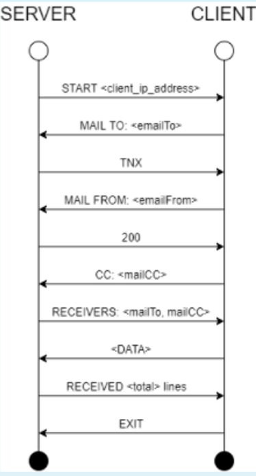

# Mail Server Solution

На сликата е прикажано сценарио за комуникација меѓу сервер и клиент при праќање на електронска порака. Ваша задача е да
го имплементирате само серверскиот дел од проблемот со тоа што:

- серверот треба да слуша на порта 8765.
- серверот треба да поддржува конкурентна комуникација со повеќе клиенти.

Сите податоци кои серверот ги добива од клиентот треба да се логираат (запишат) во server.txt датотеката чија локација е
предадена како аргумент fileOutput преку конструкторот на серверот. Таа датотека не смее да се пребрише доколку постои,
потребно е само да се дополнува (append).

Објаснувањето за секој од чекорите е прикажано во продолжение:

- Чекор 1: При нова конекција, серверот праќа порака START <client_ip_address> каде на местото на client_ip_address
  треба да стои IP адресата на клиентот.
- Чекор 2: При примање на порака од Чекор 1, клиентот враќа порака со следната содржина: MAIL_TO: <emailTo> каде emailTo
  е локалната промнлива кај клиентот.
- Чекор 3: Доколку email дресата е валидна, серверот враќа порака TNX, инаку фрла Exception. Валидна e-mail адреса е
  онаа која го содржи знакот @ во содржината.
- Чекор 4: Штом пристигне пораката TNX клиентот праќа порака со информација кој ја праќа пораката во формат: MAIL
  FROM: <emailFrom>. Променливата emailFrom ја чува клиентот.
- Чекор 5: Доколку email адресата е валидна, серверот враќа статус код 200 до клиентот. Ако не е, фрла Exception.
- Чекор 6: Клиентот враќа порака со следната содржина: MAIL_CC: <mailCC> каде mailCC е локалната променлива кај клиентот
  и назначува кој е мејлот кој треба да прими Carbon Copy на пораката.
- Чекор 7: Серверот враќа порака RECEIVERS: <mailTo, mailCC> како потврда до клиентот каде mailTo и mailCC е
  информациите кои во погорните чекори ги добил.
- Чекор 8: Клиентот почнува со праќање на податоците линија по линија. За крај, последната линија содржи само ? (
  прашалник).
- Чекор 9: Серверот враќа порака RECEIVED <total> lines, каде total означува вкупниот број на линии колку што се пратени
  во претходниот чекор преку <DATA>.
- Чекор 10: За крај на комуникација, клиентот праќа EXIT. Во тој момент серверот треба да направи flush на податоците во
  фајлот server.txt